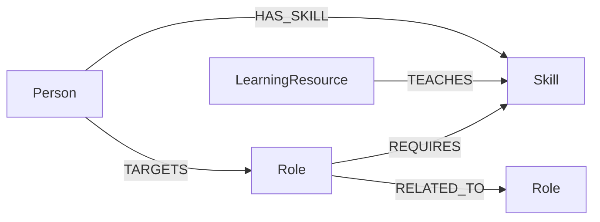

# SkillBridge Graph

**A graph-powered career path explorer for the WEXA AI CognoDB take-home assignment.**

SkillBridge helps a non-technical user answer three practical questions:

1. Which roles are connected to my current skills?
2. What skills am I missing for a target role?
3. What should I learn next?

The application is intentionally small but complete: a FastAPI web server, a CognoDB graph, a repeatable seed script, parameterized Cypher, and a responsive UI.

## Why a graph database?

Career data is not just a table of people and skills. The useful questions follow relationships:

`Person → HAS_SKILL → Skill ← REQUIRES ← Role`

and, for learning:

`Role → REQUIRES → Skill ← TEACHES ← LearningResource`

A role recommendation is therefore a connected-path problem. Skill gaps can be traced from a person's existing skills to candidate roles, and a learning path can continue from a missing skill to resources that teach it. The same model also supports multi-hop exploration without repeatedly joining large association tables.

A relational database could store the same facts, but the most interesting queries become chains of joins across people, skills, roles and resources. The graph makes the relationship pattern explicit and lets the application ask those questions directly with Cypher.

## Graph model



### Nodes

| Label | Important properties |
|---|---|
| Person | `id`, `name`, `headline` |
| Role | `id`, `title`, `level`, `description` |
| Skill | `id`, `name`, `category` |
| LearningResource | `id`, `title`, `provider`, `url` |

### Relationships

- `(:Person)-[:HAS_SKILL]->(:Skill)`
- `(:Person)-[:TARGETS]->(:Role)`
- `(:Role)-[:REQUIRES]->(:Skill)`
- `(:Role)-[:RELATED_TO]->(:Role)`
- `(:LearningResource)-[:TEACHES]->(:Skill)`

## Main graph queries

### 1. Role recommendation

Find roles connected to skills a person already has, then score them by skill overlap.

```cypher
MATCH (p:Person {id: $person_id})-[:HAS_SKILL]->(s:Skill)<-[:REQUIRES]-(r:Role)
WITH p, r, count(DISTINCT s) AS overlap
OPTIONAL MATCH (r)-[:REQUIRES]->(allSkills:Skill)
WITH p, r, overlap, count(DISTINCT allSkills) AS total_required
RETURN r.id AS id, r.title AS title, overlap, total_required,
       round(100.0 * overlap /
         CASE WHEN total_required = 0 THEN 1 ELSE total_required END
       ) AS match_percent
ORDER BY match_percent DESC
LIMIT 8
```

### 2. Multi-hop learning path

The learning flow follows this connected pattern:

`Person → HAS_SKILL → Skill ← REQUIRES ← Role → REQUIRES → Skill ← TEACHES ← LearningResource`

The API identifies missing skills for a target role and then follows each missing skill to resources that teach it.

### 3. Query that is awkward in a relational schema

The recommendation flow combines a person's skill set, the requirements of every role, and learning resources. In SQL this becomes several many-to-many joins plus aggregation and anti-joins. In Cypher the connected pattern is visible in the query itself.

All user-controlled values are passed as Cypher parameters; the application never concatenates user input into query strings.

## Project structure

```text
skillbridge-graph/
├── app/
│   ├── __init__.py
│   ├── db.py
│   ├── main.py
│   └── queries.py
├── data/
│   └── seed.json
├── scripts/
│   └── seed.py
├── static/
│   ├── index.html
│   ├── styles.css
│   └── app.js
├── docs/
│   └── README.md
├── .env.example
├── .gitignore
├── render.yaml
├── requirements.txt
└── README.md
```

## 1. Create the CognoDB instance

Create a free CognoDB Cloud instance, copy the `bolt+s://...` connection URI and save the generated password.

Official setup: https://console.cognodb.com/signup

## 2. Run locally

### Prerequisites

- Python 3.11+
- A CognoDB Cloud instance

### Install

```bash
python -m venv .venv
# Windows
.venv\Scripts\activate
# macOS/Linux
source .venv/bin/activate

pip install -r requirements.txt
```

Copy `.env.example` to `.env` and fill in:

```text
COGNODB_URI=bolt+s://<instance-id>.databases.cognodb.cloud
COGNODB_USER=cognodb
COGNODB_PASSWORD=<your-password>
```

### Seed the graph

```bash
python scripts/seed.py
```

The seed script uses `MERGE` for graph entities and relationships, so it is safe to re-run after changing the sample data. It starts by clearing the development graph.

### Start the application

```bash
uvicorn app.main:app --reload
```

Open `http://127.0.0.1:8000`.

## 3. Demo flow for the screen recording

Use this 60–90 second flow:

1. Open SkillBridge and show the green `CognoDB connected` state.
2. Start with **Maya**.
3. Point out the recommended roles and fit percentages.
4. Click **Product Engineer**.
5. Show the missing skills.
6. Show the learning resources generated by the graph traversal.
7. Switch to **Arjun**.
8. Show how the recommendation changes because the connected skills changed.
9. Briefly explain the graph model: Person → Skill → Role → LearningResource.
10. Finish by opening the repository README and showing the Mermaid data model.

## 4. Deployment on Render

This repository includes `render.yaml`.

1. Push the repository to GitHub.
2. Create a new Web Service in Render from the repository.
3. Render uses:
   - Build: `pip install -r requirements.txt`
   - Start: `uvicorn app.main:app --host 0.0.0.0 --port $PORT`
4. Add these environment variables:
   - `COGNODB_URI`
   - `COGNODB_USER=cognodb`
   - `COGNODB_PASSWORD`
5. Deploy.
6. Open the generated URL and test the live app.
7. Keep the CognoDB instance running until Wexa has reviewed the submission.

## 5. Security checklist

- Never commit `.env`.
- Never put the CognoDB password in JavaScript or HTML.
- Keep database access server-side.
- Use parameterized Cypher.
- Use a small connection pool appropriate for the free instance.
- Do not expose database credentials in logs.

## 6. Before submission

- [ ] Push all source code to GitHub.
- [ ] Verify the README setup instructions from a clean environment.
- [ ] Verify the hosted demo URL.
- [ ] Add 2–3 screenshots of the finished UI to the README.
- [ ] Record the 60–90 second walkthrough.
- [ ] Verify the CognoDB instance is still running.
- [ ] Send the GitHub URL and demo URL to `hr@wexa.ai`.
- [ ] Use subject: `CognoDB Assignment 2 – <Your Name>`.

## Assignment alignment

| Requirement | SkillBridge implementation |
|---|---|
| Thoughtful graph model | Person, Skill, Role, LearningResource + typed edges |
| Diagram in README | Mermaid graph diagram |
| Realistic seed data | 2 profiles, 6 roles, 15 skills, 9 resources |
| Seed script | `scripts/seed.py` |
| Multi-hop traversal | Skill gap → role → learning resource path |
| Relationally awkward query | Cross-role skill overlap and learning-path traversal |
| Parameterized Cypher | All IDs passed as `$parameters` |
| Functional web app | FastAPI + responsive HTML/CSS/JS |
| Loading/empty/error states | Included in UI and API |
| Environment secrets | `.env` / Render environment variables |
| Hosted demo | Render configuration included |
| Screen recording | Demo script included above |

## Sources

- CognoDB developer guide: https://cognodb.com/developers
- Neo4j official drivers: https://neo4j.com/docs/bolt/current/neo4j-drivers/
